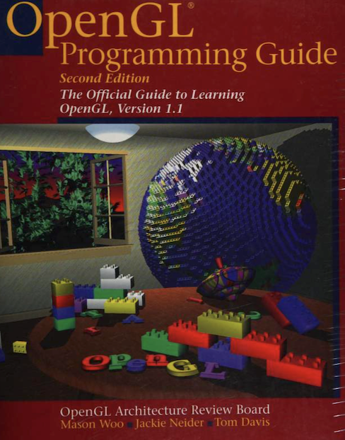

## SGI OGL Sample

This is a collection of OpenGL sample programs, circa 2000, from oss.sgi.com/projects/ogl-sample, pulled from [archive.org](https://web.archive.org/web/20171010115113/http://oss.sgi.com/cgi-bin/cvsweb.cgi/projects/ogl-sample/) using [cvsweb-extract](https://github.com/sgi-demos/cvsweb-extract).  

Some of the samples are from the OpenGL User's Guide ("Red Book").  The original README is [here](README.1st), but note that no sample OGL implementation was ever actually published to oss.sgi.com as far as I can tell, just demos and documentation.
